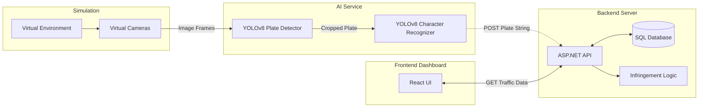

# Traffic Surveillance System - Project Overview

## 1. Introduction and Core Concept
The Traffic Surveillance System is an end-to-end distributed application designed to monitor traffic, recognize license plates, track vehicles along various routes, and manage traffic infringements. The primary goal of the system is to automate the tracking and surveillance of vehicles in real-time by capturing live footage, processing it using Artificial Intelligence models to extract text from license plates, and providing a comprehensive dashboard for operators and administrators to monitor traffic conditions and issue penalties.

## 2. Car Simulation and Environment
To overcome the difficulties of collecting live traffic camera data and testing edge cases (such as speeding or illegal lane changes) in the real world, the project utilizes a **3D simulation**. 
- **Simulation Integration:** The simulation serves as the physics and graphics engine that generates an immersive, photorealistic 3D environment populated with autonomous vehicles and pedestrians. 
- **Virtual Cameras:** Multiple virtual cameras are placed throughout the simulated city to act as traffic checkpoints. These cameras capture frame-by-frame images of the passing simulated cars and feed this data directly into the system's pipeline, acting precisely as real-world traffic cameras would.

## 3. High-Level Component Architecture
The system consists of three main architectural pillars working in harmony:

1. **AI Node (Python / YOLOv8):** 
   - Directly connects to the simulation to retrieve live camera feeds.
   - Runs a two-stage computer vision pipeline to detect vehicles, locate their license plates, and read the characters on the plates (ALPR - Automatic License Plate Recognition).
2. **Backend Server (ASP.NET Core / C#):**
   - Acts as the central brain of the system.
   - Receives the extracted plate strings and camera metadata from the AI Node.
   - Processes business logic: matches plates with registered vehicles, tracks vehicle movements across checkpoints to map routes, calculates speeds to detect infringements, and stores all historical data in the database.
3. **Frontend Application (React / JavaScript):**
   - A web-based dashboard for administrators.
   - Queries the backend via REST APIs to visualize live traffic events, camera statuses, active routes, and recorded infringements in a user-friendly interface.

### System Architecture Diagram

## 4. How the Components Talk to Each Other (Data Flow)
The entire workflow from a car driving in the simulation to an infringement appearing on the dashboard follows a strict, unidirectional data pipeline:

1. **Simulation $\rightarrow$ AI Node:** The Python AI service uses a simulation bridge script to continuously pull image frames from specific virtual camera IDs over a local network connection.
2. **AI Node $\rightarrow$ Backend Server:** Once the AI service successfully reads a license plate, it constructs a JSON payload containing the detected plate string, the camera ID, and a timestamp. It sends this data to the ASP.NET Backend using an **HTTP POST request** via REST APIs (e.g., `/api/checkpoint-detections`).
3. **Backend Server $\leftrightarrow$ Database:** The ASP.NET backend validates the incoming HTTP request, applies traffic logic (e.g., checking if the vehicle reached the next camera too fast), and executes SQL queries to persist the data into the database using Entity Framework Core.
4. **Backend Server $\rightarrow$ Frontend Dashboard:** The React application periodically fetches the latest traffic data by sending **HTTP GET requests** to various backend endpoints like `/api/dashboard`, `/api/cameras`, and `/api/infringements`. The backend responds with JSON data, which the frontend renders into charts, lists, and hierarchical views.

This decoupled architecture ensures that the intensive AI processing does not block the backend, and allows each component to be scaled and tested independently.
