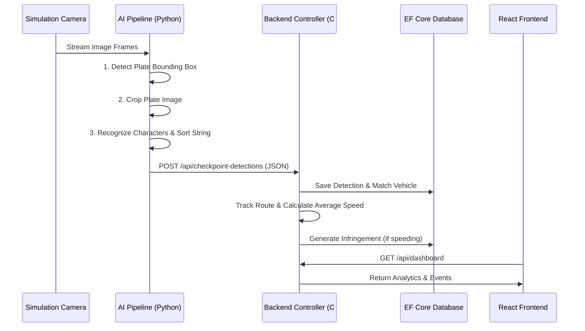

# Technical Details & Component Architecture

This document provides an in-depth breakdown of the technical inner workings of the Traffic Surveillance System, focusing specifically on the AI pipeline and the Backend architecture.

---

## 1. AI Service (ALPR - Automatic License Plate Recognition)

### System Data Flow Sequence

The AI component is written in **Python** and is designed around a continuous, two-stage object detection pipeline to achieve high accuracy in license plate recognition.

### 1.1 Model Pipeline
The core of the process relies on the **YOLOv8** architecture, chosen for its speed and precision in real-time inference.
- **Stage 1: Plate Detection (`yolo_detector.py`)** 
  - The first YOLOv8 model is trained on a custom dataset of full vehicle images (EALPR Vehicles Dataset).
  - **Input:** A full-resolution image frame from a simulation camera.
  - **Output:** Bounding box coordinates isolating the license plate from the rest of the car.
- **Stage 2: Character Recognition (`yolo_char_recognizer.py`)** 
  - The isolated bounding box (crop) from Stage 1 is fed into a second YOLOv8 model trained specifically on individual license plate characters (EALPR Characters Dataset).
  - **Input:** Cropped image of the license plate.
  - **Output:** Multiple bounding boxes, each containing an individual character and its predicted class ID.
  - **Decoding:** The recognized characters are sorted spatially from left-to-right based on their bounding box X-coordinates to reconstruct the final license plate string.

### 1.2 Runtime & Orchestration (`pipeline.py` & `runtime.py`)
- **Simulation Bridge:** A dedicated script (`carla_bridge.py`) manages the connection to the simulation server, handling the conversion of simulation sensor data into OpenCV-compatible matrices.
- **Batching & Inference:** The `pipeline.py` sequences the detection and recognition steps. The system can be configured via YAML files (`configs/pipeline.yaml`) to adjust inference thresholds, model weights paths, and hardware device execution (CPU/GPU).
- **Network Publisher:** Once a plate is decoded, `runtime.py` serializes the result and asynchronously pushes it to the configured ASP.NET backend webhook.

---

## 2. Backend Server (ASP.NET Core)
The backend is a robust RESTful API built with **C# and ASP.NET Core**, using **Entity Framework (EF) Core** for database interactions. It acts as the central state machine and business logic executor for the entire ecosystem.

### 2.1 Core Controllers & Domain Logic
The application is structured into feature-specific components:
- **`CheckpointDetectionController`:** 
  - The ingestion point for the AI service. 
  - When the AI detects a plate, it hits this controller. The backend logs the detection, links it to a `Camera` and a `Vehicle` entity, and triggers sequence tracking.
- **`RoutesController` & `VehiclesController`:** 
  - Manages the hierarchical tracking of vehicles.
  - By comparing timestamps across different cameras (checkpoints), the backend constructs a timeline (route) of a vehicle's journey through the simulated city.
- **`InfringementsController`:** 
  - Executes traffic enforcement logic. Given the known distance between two cameras and the time it took a vehicle to travel between them, the backend calculates the average speed. If this exceeds the legal limit, an `Infringement` record is generated.
- **`CamerasController` & `TrafficController`:** 
  - Manages the metadata of the simulation virtual cameras (location, ID, speed limits) and aggregates large-scale traffic density data.
- **`DashboardController`:** 
  - Provides aggregated, analytical endpoints tailored specifically for the React frontend, such as total alerts today, active routes, and system health metrics.
- **`AuthController`:** 
  - Secures the system by providing JWT-based authentication for dashboard users.

### 2.2 Data Layer (Entity Framework)
The system uses EF Core with a code-first migrations approach (located in the `Migrations` folder). The `Models` and `DTO` (Data Transfer Objects) directories maintain strict separation between database entities and the JSON structures exposed by the API, ensuring secure and efficient serialization.

---

## 3. Frontend Application (React)
The frontend is a Single Page Application (SPA) built with **React** (via Vite).
- **Architecture:** It utilizes reusable components (located in `src/components/`) and distinct view files (in `src/pages/`) for routing.
- **Styling:** Custom CSS (`index.css` and `App.css`) provides a modern dashboard look and feel, incorporating hierarchical views to easily drill down from high-level traffic stats to individual vehicle routes and specific checkpoint logs.
- **API Integration:** The `src/services/` directory contains HTTP clients mapping to the ASP.NET controllers, handling data fetching and state synchronization to present live traffic events.
